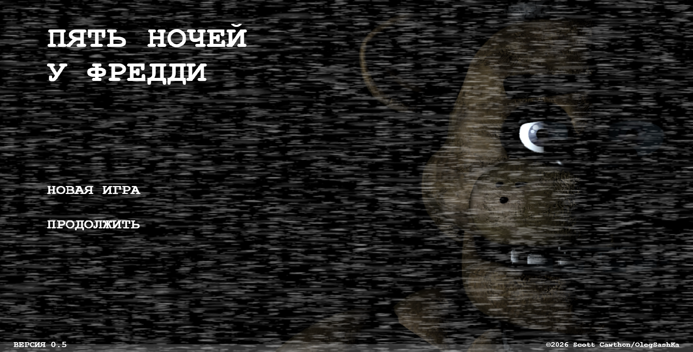
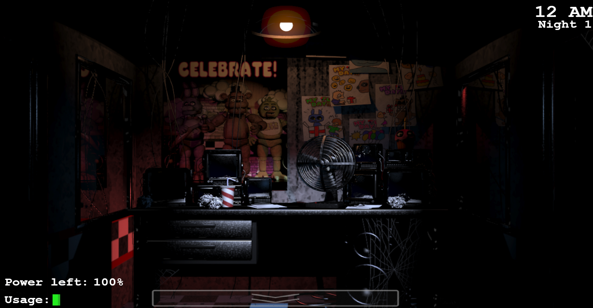
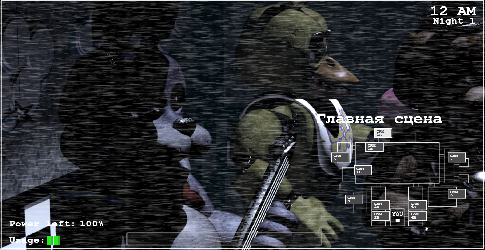

# Five Nights at Freddy's — HTML5 / Canvas Retro Clone

Аутентичный, высокооптимизированный веб-клон культовой игры **Five Nights at Freddy's 1**. Проект написан на чистом JavaScript (ES6+) с использованием объектно-ориентированного подхода (ООП) и модульной архитектуры, без использования тяжелых игровых движков.

Игра полностью адаптирована для запуска прямо в браузере и рендерится через производительный HTML5 Canvas.

---

## Онлайн-версия

Проект развернут и доступен для игры в браузере без необходимости локальной установки и настройки сервера:
[https://olegasashka.github.io/fnaf1-web-clone/](https://olegasashka.github.io/fnaf1-web-clone/)

---

## Демонстрация игрового процесса

### Главное меню


### Игровой интерфейс офиса



## Технологический стек & Библиотеки

Проект разработан по принципу **Vanilla-first** с привлечением минимального количества проверенных легковесных библиотек через CDN:
* **Движок рендеринга:** HTML5 Canvas 2D (попиксельный графический вывод, оптимизация отрисовки через листы спрайтов).
* **Основной игровой цикл:** `requestAnimationFrame` для плавной анимации панорамы офиса и эффектов помех.
* **Анимации:** [Anime.js](https://animejs.com/) (для сложных таймлайнов, таких как переход победного экрана 6 AM и движение штор).
* **Аудио-система:** [Howler.js](https://howlerjs.com/) (многоканальный микшер звуков, позиционирование шагов аниматроников, затухание эмбиента и контроль фонового шума кухни).

---

## Архитектура и Модули игры

Кодовая база разделена на независимые слабосвязанные компоненты, что исключает появление «спагетти-кода» и упрощает масштабирование:

1.  **State Manager (Управление сценами):** Архитектура на базе конечного автомата (FSM). Переключает игровые сцены (`MenuScene`, `NightScene`, `TestScene`) с правильной очисткой памяти и ассетов.
2.  **Time & Power Manager:** Автономный контроллер расхода электроэнергии офиса и хода ночных часов. Динамически рассчитывает нагрузку в зависимости от активных дверей, света и открытого планшета.
3.  **Animatronic AI & Movement Graph:** Движок перемещения врагов на основе весов вероятностей (Movement Opportunities) и графов путей. Поддерживает симуляцию глухих зон (Кухня на CAM 6).
4.  **Camera & Behavior System:** Менеджер сети камер слежения. Управляет кастомными состояниями комнат, автоматическим панорамированием объектива, эффектами помех ЭЛТ-телевизора и "морганием" при переключении.
5.  **Dynamic UI Rendering (SVG + Canvas Integration):** Уникальная система интерфейса. Тексты главного меню и HUD генерируются программно на Canvas внутри адаптивной SVG-сетки `foreignObject`. Это гарантирует монолитное векторное масштабирование под любые разрешения экранов без размытия пикселей.

---

## Особые фичи и Улучшения

* **Мультиязычность (Localization Ready):** В кодовую базу встроен централизованный словарь переводов. Смена языка интерфейса происходит динамически в один клик без перезагрузки сцены.
* **Кастомный графический контент:** Для игры были вручную подготовлены и отредактированы уникальные комбинированные кадры камер для ситуаций, когда в одной зоне одновременно находятся несколько аниматроников (например, Бонни + Чика + Фредди на Главной сцене или в Обеденной зоне).
* **Система редких пасхалок (Rare Events):** Реализован менеджер случайных событий, который при каждом переключении камер рассчитывает шанс на появление галлюцинаций (плачущие дети на стенах, меняющиеся постеры Фредди, секретные взгляды в объектив).

---

## Текущий статус разработки (Roadmap)

- [x] Модульный прелоадер ассетов и экраны загрузки
- [x] Полностью Canvas-управляемое адаптивное Главное меню
- [x] Система сохранения прогресса ночей в `localStorage`
- [x] Базовая механика Офиса (панорама взгляда мыши, хитбоксы кнопок, заклинивание приборов при проникновении)
- [x] Логика дверей и процедурного мерцания ламп освещения коридоров
- [x] Стабильная подсистема энергии, фаза полной темноты (Power Out) и шкатулка Фредди
- [x] Логика ИИ и перемещений для **Бонни** и **Чики**
- [ ] Интеграция фаз накопления агрессии **Фокси** в Пиратской Бухте и спринт по коридору
- [ ] Реализация скрытного ИИ перемещений **Фредди** (смех при смене комнат)
- [ ] Кастомное меню настройки сложности 7-й ночи (Custom Night)

---

## Как запустить проект локально

### Важное примечание по безопасности
Так как архитектура игры построена на современных модулях JavaScript (`type="module"`), современные браузеры накладывают строгие ограничения на загрузку файлов из соображений безопасности (политика CORS). Из-за этого **невозможно запустить игру, просто открыв файл index.html** двойным кликом мыши. Браузер заблокирует чтение внутренних скриптов и менеджеров. Проект обязательно должен быть запущен через локальный веб-сервер.

### Способ 1: Использование плагина в VS Code (Самый простой)
1. Откройте корневую папку проекта в редакторе Visual Studio Code.
2. Установите расширение **Live Server** (от разработчика Ritwick Dey).
3. Нажмите на кнопку **Go Live** в правом нижнем углу статус-бара VS Code. Проект автоматически откроется в браузере по адресу `[http://127.0.0.1:5500/index.html](http://127.0.0.1:5500/index.html)`.

### Способ 2: Запуск через терминал (Node.js)
1. Если у вас установлен Node.js, выполните команду в терминале внутри директории проекта для мгновенного поднятия сервера:
```bash
   npx serve```
2. Не закрывайте окно терминала — это приведет к мгновенному отключению сервера. Сверните его.
3. Откройте веб-браузер.
4. Нажмите на адресную строку в верхней части браузера, введите адрес [http://localhost:3000/](http://localhost:3000/) и нажмите Enter для инициализации игры.

### Способ 3: Запуск через терминал (Python)
Если в вашей системе установлен интерпретатор Python, вы можете поднять сервер встроенными средствами:

1. Откройте терминал или командную строку и перейдите в папку с проектом.
2. Выполните следующую команду:
   ```bash 
      python -m http.server 8000```
2. Не закрывайте окно терминала — это приведет к мгновенному отключению сервера. Сверните его.
3. Откройте веб-браузер.
4. Нажмите на адресную строку в верхней части браузера, введите адрес [http://localhost:8000/](http://localhost:8000/) и нажмите Enter для запуска игрового процесса.